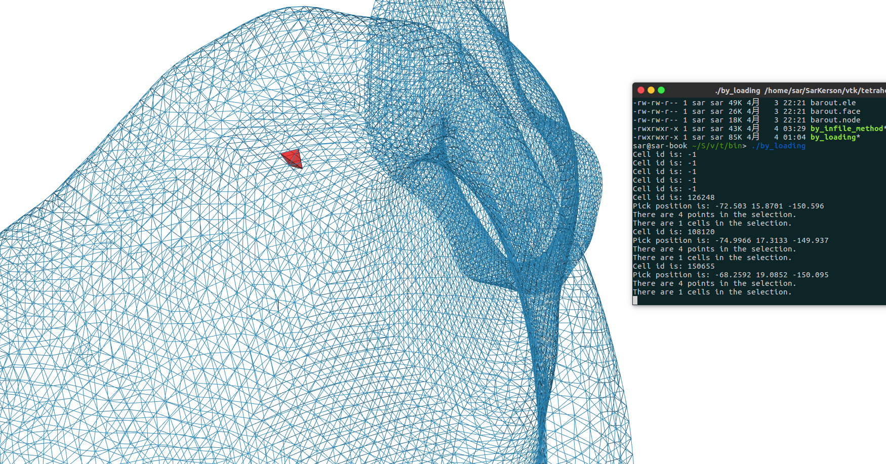

# Tetrahedralization
> Tetrahedralize and visualize 3d-object with vtk and tetgen.



# USEAGE OF TETGEN
## tetrahedralization 四面体化

The function tetrahedralize() is declared as follows:
```
void tetrahedralize(char *switches, tetgenio *in, tetgenio *out,
                    tetgenio *addin = NULL, tetgenio *bgmin = NULL);
```
**参数说明**
1. switches,相当于命令行的选项，具体参考[tetgen_man](http://wias-berlin.de/software/tetgen/1.5/doc/manual/manual005.html)，注意**不需要加横杆'-'**
2. in跟out代表输入输出，in不为空，out若不需要输出（save infos）的话，则可以为NULL
3. 后面两个可以不选（当switch含有-i, -m的话才指定）

## The tetgenio Data Type 
类成员变量包括以下：
```c++
    int firstnumber; // 0 or 1, default 0.     //起始id值
    int mesh_dim;    // must be 3.

    REAL *pointlist;                           // out...四面体化后的点集数据，比如out.pointlist[0], [1], [2]代表一个点
    REAL *pointattributelist;
    REAL *pointmtrlist;
    int *pointmarkerlist;
    int numberofpoints;                        // out...四面体化后的points数量
    int numberofpointattributes;
    int numberofpointmtrs;
 
    int *tetrahedronlist;                      // 四面体化后的index，比如out.tetrahedronlist[0], [1], [2], [3]代表一个四面体
    REAL *tetrahedronattributelist;
    REAL *tetrahedronvolumelist;
    int *neighborlist;
    int numberoftetrahedra;
    int numberofcorners;
    int numberoftetrahedronattributes;

    facet *facetlist;
    int *facetmarkerlist;
    int numberoffacets;

    REAL *holelist;
    int numberofholes;

    REAL *regionlist;
    int numberofregions;

    REAL *facetconstraintlist;
    int numberoffacetconstraints;

    REAL *segmentconstraintlist;
    int numberofsegmentconstraints;

    int *trifacelist;
    int *trifacemarkerlist;
    int numberoftrifaces;

    int *edgelist;
    int *edgemarkerlist;
    int numberofedges;
```
## 例子
```c++
#include "tetgen.h" // Defined tetgenio, tetrahedralize().
#include <iostream>

int main(int argc, char *argv[])
{
  tetgenio in, out;

  in.firstnumber = 1;
  in.load_stl("../data/Implant.stl");

  tetrahedralize("apq1.1", &in, &out);
  
  cout << out.numberofpoints << endl;
  cout << out.numberoftetrahedra << endl;
  return 0;
}
```
